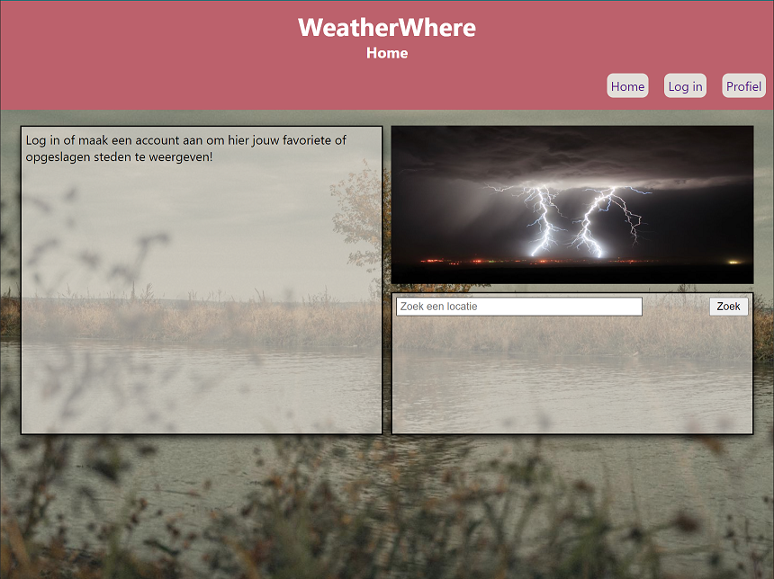

# Weatherwhere

## Inhoudsopgave
1. [Introductie](#introductie)
2. [Benodigdheden](#benodigdheden)
3. [Installatie](#installatie)
4. [Commentaar](#commentaar) 

<a name="introductie"></a>
## Introductie 

Je wilt buiten iets gaan ondernemen, maar toch eerst even het weer nakijken...

Reden genoeg voor Weatherwhere; een website waar jij jouw favoriete locaties en jouw favoriete weertypes/temperaturen kan ranken en kan opslaan. Zo kan je in 1 oogopslag zien waar het weer precies naar jouw smaak is.




<a name="benodigdheden"></a>
## Benodigdheden 

1) Voor dit project is een API key van OpenWeatherMap.org (https://openweathermap.org/api) benodigd.
   De benodigde API key voor beoordelaars kan worden gevonden in het functioneel ontwerp van dit project aan het einde van de inleidingspagina.

2) NPM - Node Package Manager -
    Dit om het project te kunnen installeren en een correcte werking te kunnen garanderen.


<a name="installatie"></a>
## Installatie 

Clone het project naar jouw locale machine.


1) New -> Project from version control... en voer onderstaande URL in.

```bash
  https://github.com/Cakeageddon/WeatherWhere.git
```

2) Installeer de dependencies door de terminal van jouw IDE.

```bash
  npm install
```

3) Creëer een .env bestand in de weatherwhere map (dus niet in de src map) en vul deze met de variabele aanwezig in het .env.dist bestand. 
Plak hier vervolgens de OpenWeather API-key erachter zonder spaties.


4) Creëer een build om het geheel werkend te krijgen.

```bash
  npm run build
```


5) Start de server

```bash
  npm run start
```

<a name="commentaar"></a>
## Commentaar 

Er wordt voor deze app gebruik gemaakt van de door NOVI Hogeschool aangeleverde back-end.
Gebruikers-accounts worden sporadisch verwijderd met als gevolg dat jij als tester/gebruiker/beoordelaar dus een account dient te registreren.

Enkele eisen hiervoor zijn:
1) Het emailadres dient een '@' te bevatten.
2) Het wachtwoord dient minimaal 6 tekens te bevatten.
3) De gebruikersnaam dient minimaal 6 tekens te bevatten.

